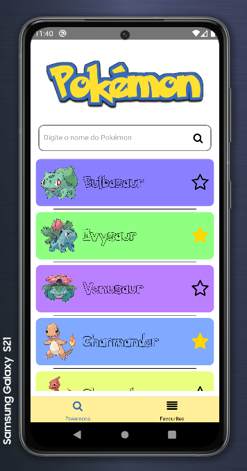

# Pokedex :alien:

## Projeto criado com React-Native e outras dependências

### Foi utilizado nesse projeto:

* #### [React-Native](https://reactnative.dev/)

* #### [React Navigation](https://reactnavigation.org/)

* #### [Axios](https://github.com/axios/axios)

* #### [Async Storage](https://github.com/react-native-async-storage/async-storage)

* #### [Zustand](https://github.com/pmndrs/zustand)

## Tutorial de Execução

### Execute em um terminal o comando:

#### `yarn start`

### Depois em outro terminal execute:

#### `npx react-native run-android`

 

### Prints da Aplicação

#### Tela Principal

#### Tela de Busca

#### Tela de Favoritos

